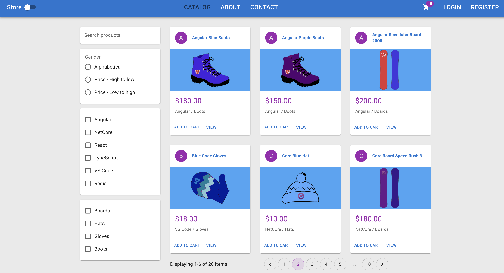

# Store App
learn from [https://www.udemy.com/course/learn-to-build-an-e-commerce-store-with-dotnet-react-redux/](https://www.udemy.com/course/learn-to-build-an-e-commerce-store-with-dotnet-react-redux/)

tech stack: .Net 6 + React.js(typescript)



## Project Structure

.
└── store_app
    ├── API
    │   ├── API.csproj
    │   ├── Controllers
    │   ├── DTOs
    │   ├── Data
    │   ├── Entities
    │   ├── Extensions
    │   ├── Middleware
    │   ├── Program.cs
    │   ├── Properties
    │   ├── RequestHelpers
    │   ├── appsettings.Development.json
    │   ├── appsettings.json
    │   ├── bin
    │   ├── obj
    │   └── store.db
    ├── README.md
    ├── client
    │   ├── README.md
    │   ├── node_modules
    │   ├── package-lock.json
    │   ├── package.json
    │   ├── public
    │   ├── src
    │   └── tsconfig.json
    ├── images
    │   └── mainPage.png
    └── store_app.sln


## Setup

### .Net

Creating .Net solution
```bash
    dotnet new list #list sdk
    dotnet new sln
    dotnet new webapi -o API # create new web API
    dotnet sln add API
```

Open in vscode
``` bash
    cd API
    dotnet run
```

Configuration

in *Properties/launchSetting.json*
```
  change port, configure protocal(http/https)  
```

in *API.csproj*
```
    configure Nullable, ImplicitUsings
```

## Entity Framework
official document: [https://learn.microsoft.com/en-us/ef/](https://learn.microsoft.com/en-us/ef/)
install the framework
```
ctrl + command + P => Nuget: Open NuGet Gallary 
=> select correspond framework
```
define [*DbContext*](API/Data/)

e.g.
```C#
using API.Entities;
using Microsoft.EntityFrameworkCore;

namespace API.Data
{
    public class StoreContext : DbContext
    {
        public StoreContext(DbContextOptions options) : base(options)
        {
        }

        public DbSet<Product> Products { get; set; }
    }
}
```

add context in configuration file
e.g. for sqlite in *Program.cs*
```
builder.Services.AddDbContext<StoreContext>(opt =>
{
    opt.UseSqlite(builder.Configuration.GetConnectionString("DefaultConnection"));
});
```
in appsettings.Development.json, add
```
  "ConnectionStrings": {
    "DefaultConnection": "Data source=store.db"
  }

```
Creating Entity Framework Migrations
```
    dotnet tool install --global dotnet-ef --version 7.0.2
    dotnet tools list - g
    dotnet toll update --global dotnet-ef
    dotnet ef migrations add InitialCreate -o Data/Migrations
```

Open databse
```
ctrl+command+P => SQLite => open database 
```
create [DbInitializer](API/Data/DbInitializer.cs)